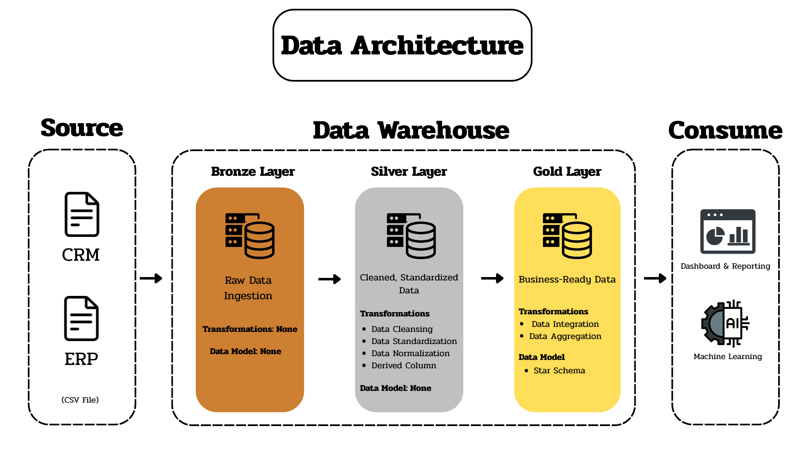
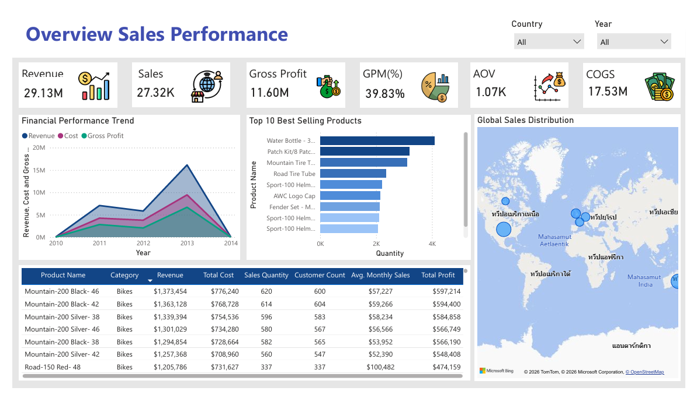

# Data Warehouse and Analytics Project

This project demonstrates a complete Data Analytics lifecycle, transforming raw retail transactional data into a **Data Warehouse** using **Medallion Architecture**. The final result is a professional **Power BI Dashboard** that empowers business stakeholders to make data-driven decisions regarding sales, profitability.

---
## 📖 Project Overview

This project involves:

1. **Data Architecture**: Designing a Modern Data Warehouse Using Medallion Architecture **Bronze**, **Silver**, and **Gold** layers.
2. **ETL Pipelines**: Extracting, transforming, and loading data from source systems into the warehouse.
3. **Data Modeling**: Developing fact and dimension tables optimized for analytical queries.
4. **Analytics & Reporting**: Creating SQL-based reports and dashboards for actionable insights.

---
## 🏗️ Data Architecture

The data architecture for this project follows Medallion Architecture **Bronze**, **Silver**, and **Gold** layers:

1. **Bronze Layer**: Stores raw data from the source systems. Data is ingested from CSV Files into SQL Server Database.
2. **Silver Layer**: This layer is about data cleansing, data transformation and standarization to prepare data for analysis.
3. **Gold Layer**: This layer is about prepare  business-ready data modeled into a star schema required for reporting and analytics.

---

---
## 📊 Dashboard

The final output is an interactive **Power BI Dashboard** connected directly to the **Gold Layer** (Star Schema), allowing stakeholders to drill down into specific regions, products, and time periods.

 

### **Key Features & Insights:**
- **Executive Summary (KPIs): **Revenue ($29.13M)**, **Gross Profit ($11.60M)**, and **GPM% (39.83%)**.
- **Financial Trends:** Dynamic line charts showing Revenue and Profit trends across Years.
- **Product Intelligence:** Visualizing Top 10 performing products to optimize inventory and sales strategy.
- **Geospatial Mapping:** Global sales distribution analysis to identify high-growth regions.
- **Advanced DAX Measures:** Implementation of complex calculations for Cost of good sales (COGS) and Average Order Value (AOV).

